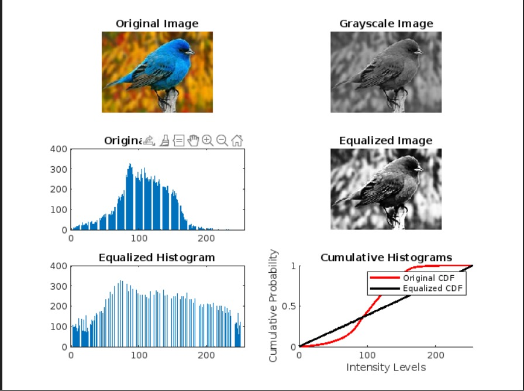

# Histogram Equalization

This MATLAB script performs histogram equalization on a grayscale image to enhance its contrast.

## Overview

- Reads an image file named `img.jpeg`.
- Converts the image to grayscale.
- Computes the histogram and cumulative distribution function (CDF) of the grayscale image.
- Applies histogram equalization to the grayscale image.
- Displays the original image, grayscale image, equalized image, and their respective histograms and CDFs.

## Instructions

1. Place `img.jpeg` in the same directory as the script.
2. Run the script in MATLAB.

## Details

- `clc`, `clear all`, `close all`: Clears the command window, workspace, and closes all figures.
- `imread`: Reads the image into `image`.
- `rgb2gray`: Converts the image to grayscale.
- `figure`, `subplot`, `imshow`, `bar`, `plot`: Creates figures with subplots, displays images, and plots histograms and CDFs.
- Computes the histogram and CDF of the grayscale image.
- Applies histogram equalization to enhance the image contrast.

## Output
![]![alt text]

## Author

Manikanta Dunna (BT22ECE104)
